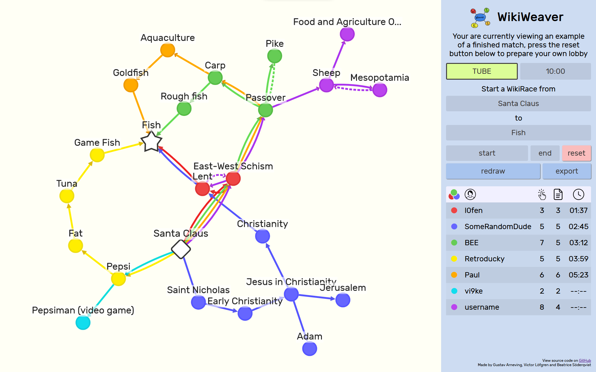

# WikiWeaver

WikiWeaver makes participating in and especially spectating WikiRaces a lot more interesting by visualizing every page you and your peers visits as a colorful node in a graph. 

## Getting started

Creating and joining lobbies is super simple.

The host goes to [stuffontheinter.net](https://stuffontheinter.net) to create and view a lobby.

All players then join this lobby using the [Firefox addon](https://addons.mozilla.org/en-US/firefox/addon/wikiweaver/). All players that have successfully joined the lobby will be shown in the leaderboard in the bottom right.

The host then decides on the start and goal pages, and proceeds to start the lobby.

The pages all the players visit will be visualized as nodes on the website. The number of pages they have visited and their finish time is also shown.

## For developers

Make the website and browser extension connect to the development server by chaning which lines are commented out at the top of `networking.js` and `background.js`, respectively. 

Serve the website in `wikiweaver-web/` using whatever webserver you like. I prefer `python3 -m http.server <port>`.

Start the server in `wikiweaver-server/` in development mode with `make dev`.

Install the extension in `wikiweaver-ext/` by running `build.sh firefox` and going to `about:debugging` in Firefox and loading the contents of the `build/` folder.
